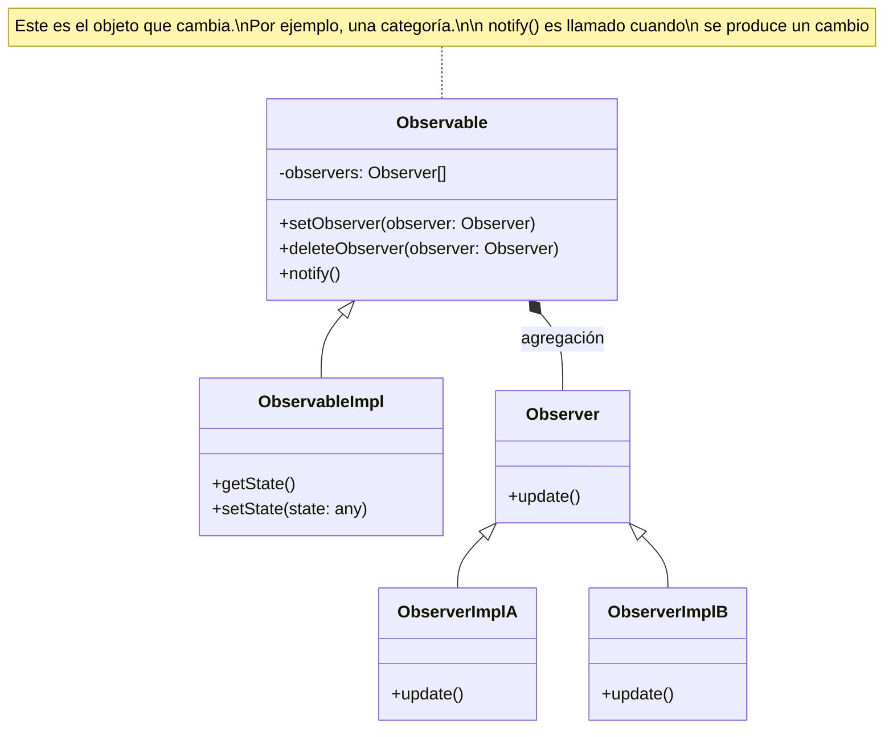
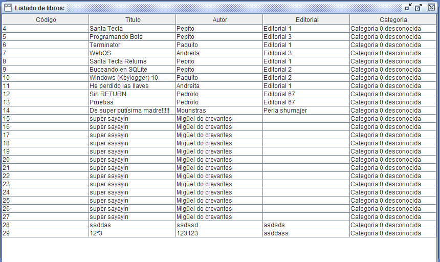
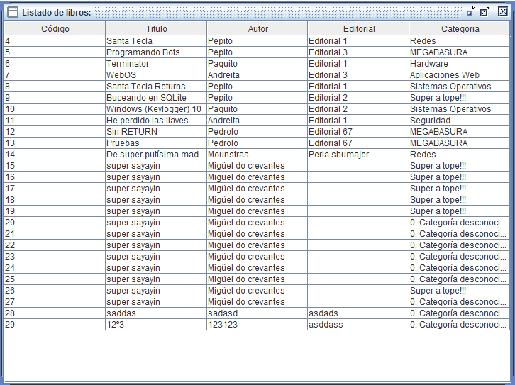
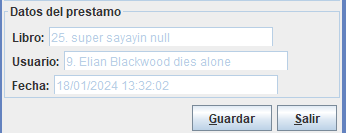

<h1 align="center"> Aplicación de Gestión de Biblioteca</h1>
<div align="center">


</div>
<br>
<p align="center">
  <a href="#-descripción-del-proyecto">Descripción</a> •
  <a href="#-correspondencia-objeto-relacional">ORM</a> •
  <a href="#-patrón-observer">Observer</a> •
  <a href="#-modelo-vista-controlador">MVC</a> •
  <a href="#-dificultades-encontradas">Problemas</a> •
  <a href="./collaboration.md">Trabajo en equipo</a>
</p>

## 📜 Descripción del proyecto

> ### ⌨ Integrantes del grupo
>
> - :feelsgood: [Red One](https://github.com/Vtsfactory16) 
> - ⏰ [Iridescent1010](https://github.com/Iridescent1010) 
> - 🖤 [CakeNeka](https://github.com/cakeneka) 

El proyecto consiste en una aplicación de gestión de una biblioteca. 
Hay que adaptar una aplicación construida previamente para que utilice el framework
**Hibernate** en lugar de JDBC. También hay que implementar el patrón
**Observer**.

### Conceptos estudiados

- Sistema ORM **Hibernate**
- Patrón **Observer**
- **Modelo-vista-controlador**
- **Java Swing**

## 🗺 Correspondencia Objeto Relacional

## 🔭 Patrón Observer

### Teoría

- Patrón de **comportamiento**
- Establece una relación entre un sujeto (o objeto **observado** (`Observable`)) y los objetos **observadores** (`Observer`)
    - `Observable` Objeto en el que se producen cambios (**notifica** a los `Observer` cuando es modificado)
    - `Observer` Objetos que son **notificados** cuando `Observable` es modificado



```java
interface Observer {
  void update(); // se llama en el método notify de observable
}
```

```java
interface Observable {
  void addObserver(); 
  void removeObserver(); // cada observable tiene una lista de observers

  void notify(); // aquí recorrerá esa lista de observers y llamará a sus métodos update()
}
```

### Implementación

- Interfaz `Observable`/ subject
  - Métodos: `notify()`
- Interfaz `Observer`

## 🕹 Modelo-vista-controlador

## Nuevas funcionalidades

- Exportar tablas a csv
- Imagen de fondo

## 🏔 Dificultades encontradas

1. Problemas al intentar **pasar el proyecto a maven**
2. De repente no va
    - Solución: `Rebuild Project` ([StackOverflow](https://stackoverflow.com/questions/12132003/getting-cannot-find-symbol-in-java-project-in-intellij))
    - 
3. Eliminar archivos .jar de git ([StackOverflow](https://stackoverflow.com/questions/1274057/how-do-i-make-git-forget-about-a-file-that-was-tracked-but-is-now-in-gitignore))
    - `git rm --cached <file>`
4. Merge conflicts
5. `@Transient`


#### Al cambiar interfaces DAO JDBC por interfaces DAO Hibernate

1. No aparecen nombres de categorías al listar libros
    - 
    - código:
    ```java
    // Old:
    public String getCategoriaDescr() {
       Categoria oCategoria = getObjCategoria();
       if (oCategoria!=null)
           return oCategoria.getCategoria();
       else return String.format("Categoria %d desconocida", categoriaId);
    }

    // New:    
    public String getCategoriaDescr() {
        if (categoria != null)
            return categoria.getCategoria();
        return "0. Categoría desconocida";
    }
    ```
    - 

2. Problemas en la selección de libros y usuarios para crear un nuevo préstamo
(código en [`FichaPrestamo.java`](./Biblioteca%20MVC/src/vista/FichaPrestamo.java))
    - Selección de **usuario**

    ```java
    // Old:
    Usuarios.seleccionaUsuario(null,"Seleccione un usuario:",true,busquedaUsuario);
    getPrestamo().setUsuarioId(busquedaUsuario.idSel);

    // New:
    Usuario selected = Usuarios.seleccionaUsuario(null,"Seleccione un usuario:",true,busquedaUsuario).getUsuario();
    getPrestamo().setUsuario(selected);

    ```
    - Selección de **libro**

    ```java
    // Old
    Libros.seleccionaLibro(null,"Seleccione un libro:",true,busquedaLibro);
    getPrestamo().setLibroId(busquedaLibro.idSel);

    // New
    Libro selected = Libros.seleccionaLibro(null,"Seleccione un libro:",true,busquedaLibro).getLibro();
    getPrestamo().setLibro(selected);
    ```



---

```yaml
Módulo: Acceso a datos
Lenguaje: Java
Tema: Tema 3. Herramientas de Mapeo Objeto-Relacional
Herramientas:
  - IntelliJ Idea Ultimate 2023.2.5
  - JDK 17
  - Hibernate core 5.6.14
  - JPA
```
